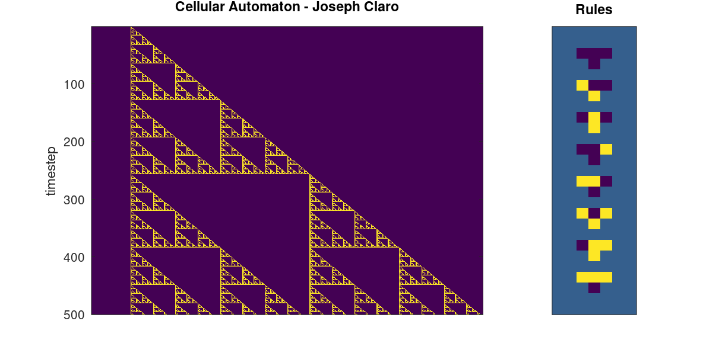
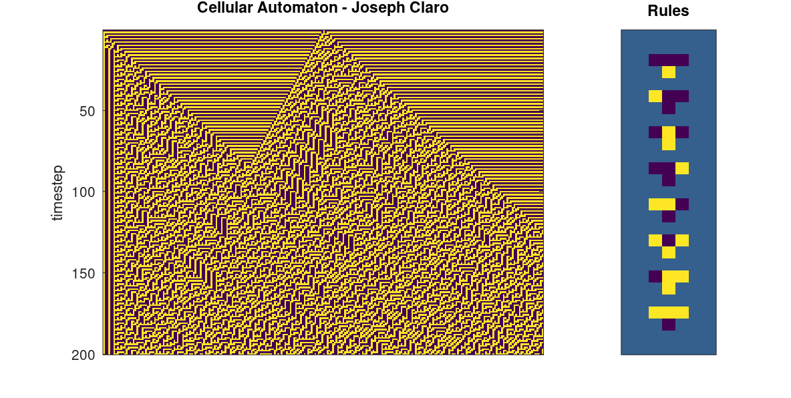
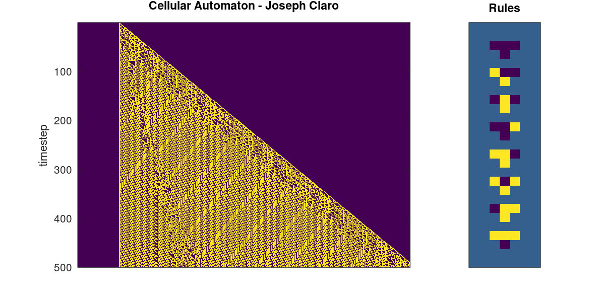

# Matlab-Cellular-Automata
This project explores the emergent patterns and chaos that can come from simple systems. It's inspired by [John Conway's Game of Life](https://playgameoflife.com), and Stephen Wolfram's work on using cellular automata to view the universe though computation: https://writings.stephenwolfram.com

The system starts with a row of binary states in a one-dimensional array, which evolves at every timestep. A two-dimensional array is created as a result, with the Y-axis acting as the time dimension.

Each array element is either 'on' (yellow) or 'off' (blue). Rules involving 'triplets' of array values determine the center element's next state. Every possible triplet is considered - 000, 001, 010, 100, 101, etc., and every triplet type has a corresponding output state. Changing the rules' output states results in varying system behaviour.

Visually, rules in action look like "If the value above me and its neighbours look like 111, then I become 0". Determining the system's evolution involves looping through these rules and updating values as needed. The rules are included on the right of the automaton's evolution.

